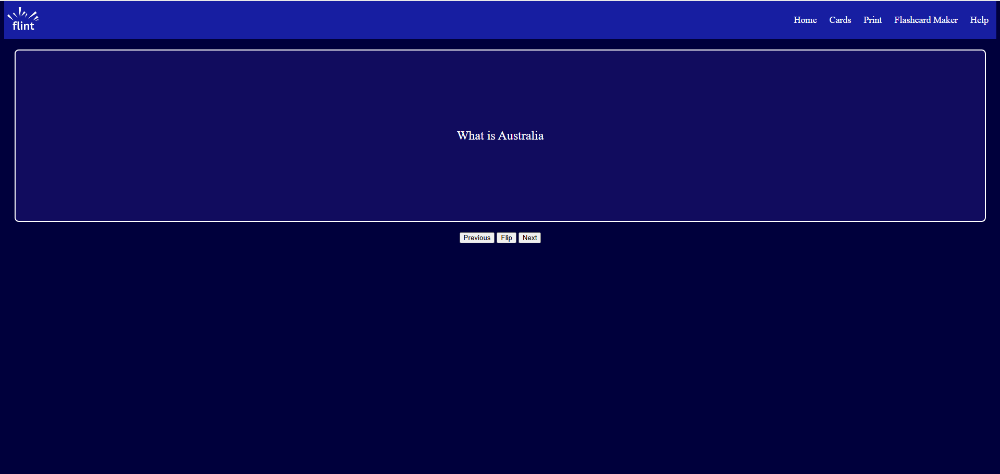

# Flint
## A flashcard app
An electron/web based FOSS flashcard application to solve the problems of existing flashcard applications. Flint solves the problems like clunky UI, poor offline functionality , lack of data exporting control, paywalls and the printing of flashcards. It will be expanded on to be the best flashcard app out there.

### Please note
- This is my second ever time using JS and my most complex use of CSS and Html ever so please ignore the fact everything took ages.
- The demo is currently  lacking lots of the core ideas and functionality such as printing, saving flashcards
to the web and etc.
### Showcase of Project
Screenshot

## How to I tick the theme Signal

### Why did I create flint?
I created flint in order to remove the paywall locked features of popular flashcard apps and allow for easier creation of flashcards. I especially wanted to improve on the printing provess of existing flashcard apps which led to the creation of this program.
### Inspiration
- Quizlet
- Anki

### Devlog (See commits)
### Technologies used
- Electron (planned)
- JS
- Html
- Css
### Demo Install Instructions
- Visit Github Sites Url - http://riley-d-1.github.io/Flint/
- Then download the test markdown file
- Use the flashcard app by importing markdown file and then flashcarding
